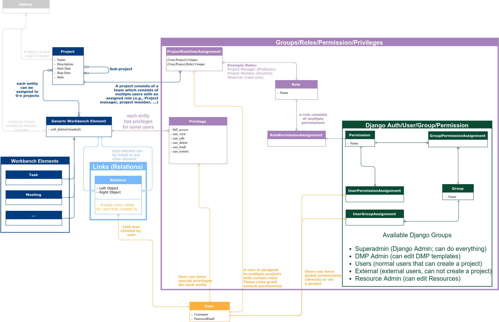
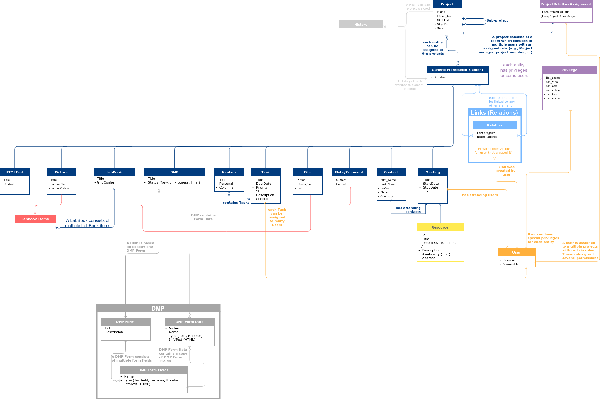

Database Models
===============

Basic Features for eRIC Workbench Elements
------------------------------------------

eRIC Workbench Elements (such as DMP, Kanban, LabBook, Task, Meeting, Contact, File, ...) have several common features.
Each element

- can be assigned to any number of projects
- can have privileges on a per-user base
- can be trashed (soft-deleted), restored and/or fully deleted
- have a history of all changes
- can be linked to any number of other elements

Diagram
-------

All elements are stored in a database and are mapped to Django Models. The following two diagrams show

- the general structure of eRIC Workbench (Privileges, Permissions, Roles, Groups, History, Links) and
- specific structure of eRIC Workbench Elements (DMPs, Kanban, LabBook, Files, Contact, Meeting, ...)

The two models are stored in xml files which were created using draw.io:

- ``docs/workbench_overview_model.xml``
- ``docs/workbench_elements_model.xml``

