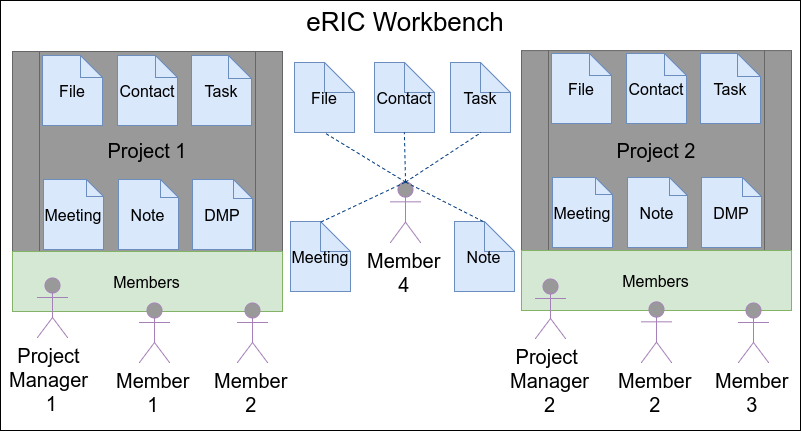

Access Control List / Privileges / Permissions
==============================================

eRIC Workbench offers three ways of granting access to entities or allowing certain actions.

- Global Permissions (Users or Groups) - e.g., Administrator
- Project Permissions (based on Roles) - e.g., Project Manager, Observer
- Permissions for a single Entity (Privileges) - e.g., users assigned to a Task are allowed to view and edit the Task

The easiest way of giving access is by using global permissions on users or groups. However, most permissions should
not be applied globally, but related to a Project (Roles) or an Entity (Privileges). The following sections will
provide more information about the possibilities of granting access on those levels.

Showcase
--------

The following picture showcases the different ways of granting access:

There are two projects (Project 1 and Project 2) with separate Project Managers (Project Manager 1 and Project Manager
2). Within these two projects are two Members: Project 1 has Member 1 and Member 2, while Project 2 has Member 2 and
Member 3. In addition, Member 4 is not part of any project, but has access to some entities.

The global permissions, e.g., ``add_project``, would be necessary for Project Manager 1 to create the Project. Within
this Project, Project Manager 1 would need Project-related permissions to create entities and invite members.

Member 4 needs to be able to create entities without a project, and therefore needs the global permission
``add_{model}_without_project``. However, Member 4 must *not* have the ``view_{model}`` permission globally. Instead,
entity-specific permissions are necessary for Member 4, who created entities without a project.

General
-------

eRIC Workbench makes use of `Djangos Default permissions <https://docs.djangoproject.com/en/1.11/topics/auth/default/#default-permissions>`_ for each project-related ``{model}`` (e.g., ``task``, ``project``,
``meeting``, ``file``, ``note``, ``dmp``, ...):

- ``add_{model}`` - allows creating a new entity
- ``change_{model}`` - allows changing an existing entity
- ``delete_{model}`` - allows deleting an existing entity

In addition, eRIC Workbench introduces the following permissions for each model:

- ``view_{model}`` - allows viewing an existing entity
- ``trash_{model}`` - allows trashing an existing entity
- ``restore_{model}`` - allows restoring an existing entity
- ``add_{model}_without_project`` - allows creating a new entity without relating it to a project (this should be used within a Group to apply globally, and not within a Project Role)
- ``change_project_{model}`` - allows changing the project of an entity

Permissions of the Project Model
^^^^^^^^^^^^^^^^^^^^^^^^^^^^^^^^

As the ``Project`` model itself has different relations (e.g., a Project can contain multiple Tasks, Meetings, etc...),
there have to be different permissions. The ``add_project``, ``change_project``, ``delete_project`` and ``view_project``
permissions are equivalent to the permissions detailed above. In addition, the following permissions are available:

- ``invite_external_user`` - allows inviting (external) users to the workbench (by using their email address)
- ``change_parent_project`` - allows changing the parent project of a given project (see :ref:`Links`)

Permissions for Assigning Users (Members) to a Project with a certain Role
^^^^^^^^^^^^^^^^^^^^^^^^^^^^^^^^^^^^^^^^^^^^^^^^^^^^^^^^^^^^^^^^^^^^^^^^^^

Assigning users to a project with a certain role is managed by the ``ProjectRoleUserAssignment`` model. This model has
the following permissions:

- ``view_projectroleuserassignment`` - allows viewing project/role/user assignments
- ``add_projectroleuserassignment`` - allows creating a new project/role/user assignments
- ``change_projectroleuserassignment`` - allows changing an existing project/role/user assignments
- ``delete_projectroleuserassignment`` - allows deleting an existing project/role/user assignments

Global Permissions: Groups and Users
------------------------------------

All of the above mentioned permissions can be assigned to Django Groups aswell as Users. However, applying those
permissions to Groups or Users will mean that they the user will have this permission globally. For instance, giving a
user the ``add_task`` permissions means that the user can create Tasks in any Project. Similarly, the ``view_task``
permission means that the user is allowed to view all Tasks of all Projects.

Therefore we would like to advise you, that only the following permissions should be applied globally, preferably using
groups:

- ``add_project`` - allows creating new projects
- ``add_{model}_without_project``, where ``{model}`` is ``Task, Meeting, Note, File, Contact,`` or ``DMP`` - allows creating
  new entities without the need of having access to a project
- ``invite_external_user`` - allows inviting external users

All other permissions should NOT be applied globally, but in so called ``Roles`` (see next section for details).

In the default configuration, eRIC Workbench will create the following two groups with the following permissions:

- Group ``User`` (e.g., for already registered users, or users that come from an additional authentication backend such
  as ldap):

  - ``add_project``
  - ``add_{model}_without_project``
  - ``invite_external_user``

- Group ``External`` without any extra permissions (this is for users that have been invited, they should by default
  not be allowed to do anything, except for their project-specific permission)

Project-specific Permissions: Roles
-----------------------------------

Contrary to global permissions, project-specific permissions are only applied on entities that are related to a project.
This enables Roles like Project Manager, Project Member and Observer.

Role Project Manager
^^^^^^^^^^^^^^^^^^^^

The Project Manager roles enables the user to do everything with project-related entities. In addition, this role
enables the user to edit project details (title, description, start and stop date, etc...), and to change the parent
project.

Here is a comprehensive list of permissions for the Project Manager Role:

- ``view_project`` - viewing the project is always necessary
- ``change_project`` - a Project Manager can change details of a project
- ``add_project`` - a Project Manager can also create new projects and relate them to the current project (by using the
  parent project relationship)
- ``view_projectroleuserassignment`` - a Project Manager should be able to view all project members and their roles
- ``add_projectroleuserassignment`` - a Project Manager should be able to add a new project member with a role
- ``change_projectroleuserassignment`` - a Project Manager should be able to change the role of a project member
- ``delete_projectroleuserassignment`` - a Project Manager should be able to remove a project member from the project

In addition, for all entities (e.g., Task, Meeting, Note, File, Contact) the following permissions are applied:

- ``view_task``, ``view_meeting``, ``view_note``, ``view_file``, ``view_contact`` - allows viewing those
  entities within the project
- ``add_task``, ``add_meeting``, ``add_note``, ``add_file``, ``add_contact`` - allows creating those
  entities within the project
- ``change_task``, ``change_meeting``, ``change_note``, ``change_file``, ``change_contact`` - allows
  changing those entities within the project
- ``restore_task``, ``restore_meeting``, ``restore_note``, ``restore_file``, ``restore_contact`` - allows
  restoring those entities
- ``trash_task``, ``trash_meeting``, ``trash_note``, ``trash_file``, ``trash_contact`` - allows
  trashing those entities
- ``delete_task``, ``delete_meeting``, ``delete_note``, ``delete_file``, ``delete_contact`` - allows
  deleting those entities
- ``change_project_task``, ``change_project_meeting``, ``change_project_note``, ``change_project_file``,
  ``change_project_contact`` - allows changing the project of those entities

Role Project Member
^^^^^^^^^^^^^^^^^^^

A Project Member should be allowed to actively participate in the project, e.g., by creating Tasks, writing comments,
etc... However, a Project Member should not be allowed to change details of the project, change roles of a member,
nor delete any entities.

Here is a comprehensive list of permissions:

- ``view_project`` - viewing the project is always necessary
- ``view_projectroleuserassignment`` - a Project Member should be able to view all project members and their roles, but
  not changing or deleting those
- ``view_task``, ``view_meeting``, ``view_note``, ``view_file``, ``view_contact``, ``view_dmp`` - allows viewing those
  entities within the project
- ``add_task``, ``add_meeting``, ``add_note``, ``add_file``, ``add_contact``, ``add_dmp`` - allows creating those
  entities within the project
- ``change_task``, ``change_meeting``, ``change_note``, ``change_file``, ``change_contact``, ``change_dmp`` - allows
  changing those entities within the project

Role Observer
^^^^^^^^^^^^^

The role *Observer* only grants read-access to certain entities. Project members with this role are *not allowed* to
create, change or delete any objects within the project.

Here is a comprehensive list of permissions:

- ``view_project`` - viewing the project is always necessary
- ``view_projectroleuserassignment`` - a Project Member should be able to view all project members and their roles, but
  not changing or deleting those
- ``view_task``, ``view_meeting``, ``view_note``, ``view_file``, ``view_contact``, ``view_dmp`` - allows viewing those
  entities within the project

Role No Access
^^^^^^^^^^^^^^

The role *No Access* is automatically created and does not grant any permissions within the project. This role is
equivalent of removing a user from a project. However, sometimes it is beneficial to still know that a specific user
is still part of the project, but (temporarily) does not have any access (e.g., former employees, a customer that did
not pay the last bill, etc...).

This role has no permissions.

Entity-specific Permissions: Privileges
---------------------------------------

In addition to global permissions and project-specific permissions, each entity has so called Privileges. For instance,
when creating an element, the privilege ``is_owner`` or ``full_access`` is automatically created for the current user.
For the model and REST API implementation, please look into the ``model_privileges`` app in
``app/eric/model_priviliges``.

In addition to project-role-specific permissions, Model Privileges allow or deny the current user to view, edit, delete
or restore the related entity. Model Privileges can be positive (as in granting access) as well as negative (denying
access) or neutral (inherit privileges). The following privileges are available:

- ``is_owner`` or ``full access`` - allows everything with this entity, including changing privileges (default privilege
  automatically created for the user that created the entity)
- ``view`` - allows viewing the entity
- ``edit`` - allows changing the entity
- ``trash`` - allows trashing the entity
- ``delete`` - allows deleting the entity (after it was trashed)
- ``restore`` - allows restoring the entity (after it was trashed)

These privileges are especially useful when creating entities without relating them to a project. Privileges furthermore
allow adding users to entities that would not be able to see them otherwise.

Rules:

- ``full access`` overwrites every other privilege/permission
- There must always be at least one user with the ``full_access`` privilege
- Only users with the ``full_access`` privilege can change privileges

Assigned Users (Tasks)
^^^^^^^^^^^^^^^^^^^^^^

Assigned Users of Tasks are automatically given the ``view`` and ``edit`` privilege.

This is implemented in ``TaskPrivilege`` in ``app/eric/shared_elements/models/model_privileges.py`` as well as
``TaskQuerySet`` in ``app/eric/shared_elements/models/querysets.py``.

Attending Users (Meetings)
^^^^^^^^^^^^^^^^^^^^^^^^^^

Attending Users of a Meeting are automatically given the ``view`` privilege.

This is implemented in ``MeetingPrivilege`` in ``app/eric/shared_elements/models/model_privileges.py`` as well as
``MeetingQuerySet`` in ``app/eric/shared_elements/models/querysets.py``.

Contacts
^^^^^^^^

If a user is attending a meeting, said user is given the ``view`` privilege on all attending contacts.

This is implemented in ``ContactPrivilege`` in ``app/eric/shared_elements/models/model_privileges.py`` as well as
``ContactQuerySet`` in ``app/eric/shared_elements/models/querysets.py``.

KanbanBoard
^^^^^^^^^^^

All Tasks listed in a KanbanBoard can be viewed by users that can view the KanbanBoard.

This is implemented in ``KanbanBoardTaskPrivilege`` in ``app/eric/kanban_boards/models/model_privileges.py`` as well as
``ExtendedKanbanBoardTaskQuerySet`` in ``app/eric/kanban_boards/models/querysets.py``.

LabBook
^^^^^^^

All elements of a LabBook (File, Note, Picture) can be viewed by users that can view the LabBook. They also can be
changed/modified by users that can edit the LabBook.

This is implemented in ``LabBookPicturePrivilege`` in ``app/eric/labbooks/models/model_privileges.py`` as well as
``ExtendedLabBookPictureQuerySet``, ``ExtendedLabBookFileQuerySet``, ``ExtendedLabBookNoteQuerySet`` in
``app/eric/labbooks/models.querysets.py``.

Links and Notes (Comments)
^^^^^^^^^^^^^^^^^^^^^^^^^^

If a comment is made on any object, it should be visible to any one that can view the object. However, this is not
applied when the /api/notes/ endpoint is queried.

How the REST API ViewSet collects Project Permissions, Task/Meeting Context and Privileges
^^^^^^^^^^^^^^^^^^^^^^^^^^^^^^^^^^^^^^^^^^^^^^^^^^^^^^^^^^^^^^^^^^^^^^^^^^^^^^^^^^^^^^^^^^

Collecting these privileges is handled in ``app/eric/model_privileges/rest/viewsets.py`` within the
``permissions_by_user`` dictionary, and works as follows:

First, project permissions for the given entity are determined and stored in the ``permission_by_user`` dictionary.
For instance, the ``view_task`` permission within a project role is applied to the ``view_privilege`` for a Task.

Second, context-based privileges (e.g., for Tasks and Meetings) are determined and override the project permissions
in the ``permission_by_user`` dictionary.

Example for Tasks:

.. code-block:: python

    for assigned_user in obj.assigned_users.all():
        permissions_by_user[assigned_user.pk] = UserPermission(
            assigned_user,
            obj.id, obj.get_content_type(),
            is_context_permission=True, can_view=True
        )

Similar things are happening for meetings:

.. code-block:: python

    for attending_user in obj.attending_users.all():
        permissions_by_user[attending_user.pk] = UserPermission(
            attending_user,
            obj.pk,
            obj.get_content_type(),
            is_context_permission=True,
            can_view=True
        )

The ``permissions_by_user`` dictionary is then combined with the privileges stored in database (this means that
privileges stored in the database can override all previously determined privileges).

Privilege Use Cases
-------------------

Note: Only users with the Full Access privilege are allowed to change privileges.

P UC 1
^^^^^^

User A creates (or edits) an entity (e.g., a task) without a project and wants to give other users the view privilege.
The other users will only be able to view the task, but not to edit or delete it.

P UC 2
^^^^^^

User A creates (or edits) an entity (e.g., a task) within a project and wants to remove the view/edit/delete privilege from one or more users.
This means that users that should have access to the entity because of their role in a project, will no longer be able to view/edit/delete the entity.

P UC 3
^^^^^^

User A creates (or edits) an entity (e.g., a task) and gives the Full Access privilege to another user.
This means that the other user can now, view, edit, delete the entity, and also edit its privileges.

Technical Information about Permissions and Privileges
======================================================

Those permissions are furthermore applied either globally (directly to the user or via group), or project-specific via
a role. In addition, it is possible to create objects without project-relationship. The REST API checks those
permissions via Django Handlers, which are defined in ``app/eric/projects/models/handlers.py`` (this is especially true
for the ``add_{model}`` and ``add_{model}_without_project`` permission). In addition, the access
to certain objects is defined via QuerySets in the methods:

- ``viewable()`` - defines all the viewable objects for the current user
- ``deletable()`` - defines all deletable objects for the current user
- ``editable()`` - defines all editable objects for the current user

The main class to look for the implementation of these methods is ``BaseProjectPermissionQuerySet`` in
``app/eric/projects/models/querysets.py``.

Example: Task Assignees are allowed to view and edit Tasks
----------------------------------------------------------

We register a privilege handler in ``app/eric/shared_elements/models/model_privileges.py``:

.. code:: python

    from eric.model_privileges.utils import BasePrivilege, UserPermission, register_privilege

    @register_privilege(Task)
    class TaskPrivilege(BasePrivilege):
        """
        If a user is assigned to a Task, the same user is allowed to view and edit the task
        """
        @staticmethod
        def get_privileges(obj, permissions_by_user=dict()):

            # iterate over all assigned users
            for assigned_user in obj.assigned_users.all():
                if assigned_user.pk not in permissions_by_user:
                    # create a new privilege for the user
                    permissions_by_user[assigned_user.pk] = UserPermission(
                        assigned_user,
                        obj.pk, obj.get_content_type(),
                        is_context_permission=True, can_view=True, can_edit=True
                    )
                else:
                    # overwrite the privilege
                    permissions_by_user[assigned_user.pk].view_privilege = ModelPrivilege.PRIVILEGE_CHOICES_ALLOW
                    permissions_by_user[assigned_user.pk].edit_privilege = ModelPrivilege.PRIVILEGE_CHOICES_ALLOW

            return permissions_by_user

The above privilege handler is responsible for properly displaying privileges of a user. This is accomplished using the 
``@register_privilege`` decorator for ``Task``, which decorates a class (inheriting from ``BasePrivilege``), which implements a 
static ``get_privileges`` method. This method gets an object ``obj`` (which we need to fetch the privileges for - in this example a task), 
and a dictionary ``permissions_by_user``, which contains existing permissions/privileges for several users.

Within the ``get_privileges`` method, additional privileges are determined by iterating over the tasks ``assigned_users``.

However, the code snippet from above is not responsible for actually handling the
view and edit permission of a Task. This is done with the ``@extend_queryset`` decorator in ``app/eric/shared_elements/models/querysets.py``:

.. code:: python

    from eric.projects.models.querysets import extend_queryset

    @extend_queryset(TaskQuerySet)
    class TaskAssignedUsersViewableEditableQuerySet:
        """
        Extending Task QuerySet for Assigned Users
        If a user is assigned to a task, the user is allowed to view and edit the task
        """

        @staticmethod
        def _viewable():
            from eric.shared_elements.models import Task
            user = get_current_user()

            # get all tasks that the current user is assigned to
            task_pks = Task.objects.filter(assigned_users=user).values_list('pk')

            return Q(
                pk__in=task_pks
            )

        @staticmethod
        def _editable():
            from eric.shared_elements.models import Task
            user = get_current_user()

            # get all tasks that the current user is assigned to
            task_pks = Task.objects.filter(assigned_users=user).values_list('pk')

            return Q(
                pk__in=task_pks
            )

The key component here is that we extend the existing ``TaskQuerySet`` by calling the decorator ``@extend_queryset``, and providing
a class which implements a static ``_viewable`` and static ``_editable`` method (there also is a static ``_deletable`` method).

Example: All Children of a LabBook are viewable and editable if the LabBook is viewable/editable
------------------------------------------------------------------------------------------------

Specify privileges:

.. code:: python

    from eric.model_privileges.utils import BasePrivilege, UserPermission, register_privilege, \
        get_model_privileges_and_project_permissions_for
    from eric.shared_elements.models import File, Note
    from eric.pictures.models import Picture
    from eric.labbooks.models import LabBook
    from eric.model_privileges.models import ModelPrivilege

    @register_privilege(Picture, execution_order=999)
    @register_privilege(File, execution_order=999)
    @register_privilege(Note, execution_order=999)
    class LabBookCellPrivilege(BasePrivilege):
        """
        If a user can view a LabBook, the user can also view all cells within the LabBook
        Same is true for edit: if a user can edit a labbook, the user can also edit all cells within the LabBook
        """
        @staticmethod
        def get_privileges(obj, permissions_by_user=dict()):
            # get all LabBooks that contain the picture
            lab_books = LabBook.objects.viewable().filter(
                child_elements__child_object_content_type=obj.get_content_type(),
                child_elements__child_object_id=obj.pk
            )

            # iterate over all those labbooks and collect the users that have the view privilege
            for lab_book in lab_books:
                # get privileges for the labbook
                lab_book_privileges = get_model_privileges_and_project_permissions_for(LabBook, lab_book)

                for priv in lab_book_privileges:
                    user = priv.user

                    # check if user is already in permissions_by_user
                    if user.pk not in permissions_by_user.keys():
                        permissions_by_user[user.pk] = UserPermission(
                            user,
                            obj.pk, obj.get_content_type()
                        )

                    # check if view privilege is set
                    if priv.view_privilege == ModelPrivilege.PRIVILEGE_CHOICES_ALLOW \
                            or priv.full_access_privilege == ModelPrivilege.PRIVILEGE_CHOICES_ALLOW:
                        permissions_by_user[user.pk].view_privilege = ModelPrivilege.PRIVILEGE_CHOICES_ALLOW
                        permissions_by_user[user.pk].is_context_permission = True
                    elif priv.view_privilege == ModelPrivilege.PRIVILEGE_CHOICES_DENY:
                        permissions_by_user[user.pk].view_privilege = ModelPrivilege.PRIVILEGE_CHOICES_DENY
                        permissions_by_user[user.pk].is_context_permission = True

                    # check if edit privilege is set
                    if priv.edit_privilege == ModelPrivilege.PRIVILEGE_CHOICES_ALLOW \
                            or priv.full_access_privilege == ModelPrivilege.PRIVILEGE_CHOICES_ALLOW:
                        permissions_by_user[user.pk].edit_privilege = ModelPrivilege.PRIVILEGE_CHOICES_ALLOW
                        permissions_by_user[user.pk].is_context_permission = True
                    elif priv.edit_privilege == ModelPrivilege.PRIVILEGE_CHOICES_DENY:
                        permissions_by_user[user.pk].edit_privilege = ModelPrivilege.PRIVILEGE_CHOICES_DENY
                        permissions_by_user[user.pk].is_context_permission = True

            return permissions_by_user

Handle permissions in QuerySet:

.. code:: python

    @extend_queryset(PictureQuerySet)
    class ExtendedLabBookPictureQuerySet:
        """
        Extending Picture QuerySet for LabBooks
        If a Picture is in a LabBook, users are allowed to view and/or edit those pictures if they are allowed to view/edit
        the LabBook
        """

        @staticmethod
        def _viewable():
            """
            Extend PictureQuerySet such that it allows viewing of Picture that are assigned in a Labbook where the current
            user is allowed to view the LabBook
            :return: django.db.models.Q
            """
            from eric.labbooks.models import LabBookChildElement
            from eric.pictures.models import Picture

            # get all viewable LabBookChildElements that contain a picture
            picture_pks = LabBookChildElement.objects.viewable().filter(
                child_object_content_type=Picture.get_content_type()
            ).values_list('child_object_id')

            # return Picture.filter(pk__in=note_pks)
            return Q(
                pk__in=picture_pks
            )

        @staticmethod
        def _editable():
            """
            Extend PictureQuerySet such that it allows editing of Picture that are assigned in a Labbook where the current
            user is allowed to edit the LabBook
            :return: django.db.models.Q
            """
            from eric.labbooks.models import LabBookChildElement
            from eric.pictures.models import Picture

            # get all viewable LabBookChildElements that contain a note
            picture_pks = LabBookChildElement.objects.editable().filter(
                child_object_content_type=Picture.get_content_type()
            ).values_list('child_object_id')

            # return Picture.filter(pk__in=note_pks)
            return Q(
                pk__in=picture_pks
            )

    @extend_queryset(NoteQuerySet)
    class ExtendedLabBookNoteQuerySet:
        """
        Extending the Note QuerySet for LabBooks
        If a Note is in a LabBook, users are allowed to view and/or edit those notes if they are allowed to view/edit the
        LabBook
        """
        @staticmethod
        def _viewable():
            """
            Extend NoteQuerySet such that it allows viewing of Notes that are assigned in a Labbook where the current
            user is allowed to view the LabBook
            :return: django.db.models.Q
            """
            from eric.shared_elements.models import Note
            from eric.labbooks.models import LabBookChildElement

            # get all viewable LabBookChildElements that contain a note
            note_pks = LabBookChildElement.objects.viewable().filter(
                child_object_content_type=Note.get_content_type()
            ).values_list('child_object_id')

            # return Note.filter(pk__in=note_pks)
            return Q(
                pk__in=note_pks
            )

        @staticmethod
        def _editable():
            """
            Extend NoteQuerySet such that it allows editing of Notes that are assigned in a Labbook where the current
            user is allowed to edit the LabBook
            :return: django.db.models.Q
            """
            from eric.shared_elements.models import Note
            from eric.labbooks.models import LabBookChildElement

            # get all viewable LabBookChildElements that contain a note
            note_pks = LabBookChildElement.objects.editable().filter(
                child_object_content_type=Note.get_content_type()
            ).values_list('child_object_id')

            # return Note.filter(pk__in=note_pks)
            return Q(
                pk__in=note_pks
            )

    @extend_queryset(FileQuerySet)
    class ExtendedLabBookFileQuerySet:
        """
        Extending the File QuerySet for LabBooks
        If a File is in a LabBook, users are allowed to view and/or edit those files if they are allowed to view/edit the
        LabBook
        """
        @staticmethod
        def _viewable():
            """
            Extend FileQuerySet such that it allows viewing of Notes that are assigned in a Labbook where the current
            user is allowed to view the LabBook
            :return: django.db.models.Q
            """
            from eric.shared_elements.models import File
            from eric.labbooks.models import LabBookChildElement

            # get all viewable LabBookChildElements that contain a note
            file_pks = LabBookChildElement.objects.viewable().filter(
                child_object_content_type=File.get_content_type()
            ).values_list('child_object_id')

            # return File.filter(pk__in=file_pks)
            return Q(
                pk__in=file_pks
            )

        @staticmethod
        def _editable():
            """
            Extend FileQuerySet such that it allows editing of Notes that are assigned in a Labbook where the current
            user is allowed to edit the LabBook
            :return: django.db.models.Q
            """
            from eric.shared_elements.models import File
            from eric.labbooks.models import LabBookChildElement

            # get all viewable LabBookChildElements that contain a note
            file_pks = LabBookChildElement.objects.editable().filter(
                child_object_content_type=File.get_content_type()
            ).values_list('child_object_id')

            # return File.filter(pk__in=file_pks)
            return Q(
                pk__in=file_pks
            )

