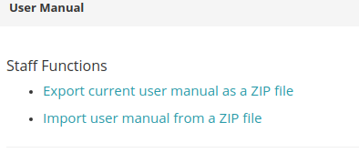

.. _UserManual:

User Manual
===========

The User Manual is stored within the ``user_manual`` app and its models. A staff user can edit the
User Manual in the Django Admin if the following permissions are set:

- 'user_manual.add_usermanualhelptext',
- 'user_manual.add_usermanualplaceholder',
- 'user_manual.add_usermanualcategory',
- 'user_manual.change_usermanualhelptext',
- 'user_manual.change_usermanualplaceholder',
- 'user_manual.change_usermanualcategory',
- 'user_manual.delete_usermanualhelptext',
- 'user_manual.delete_usermanualplaceholder',
- 'user_manual.delete_usermanualcategory'

It is recommended that these permissions are added to a group (e.g., User Manual Admin), which is then assigned to the specific user.

In the Workbench Frontend there are two options in the User Manual modal dialog:

This allows exporting the user manual from one server (e.g., staging server), and importing it on another.
These options are only visible for users that are staff or admin users.
